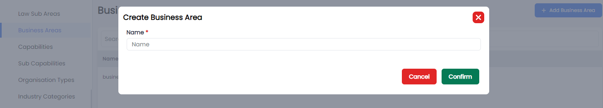
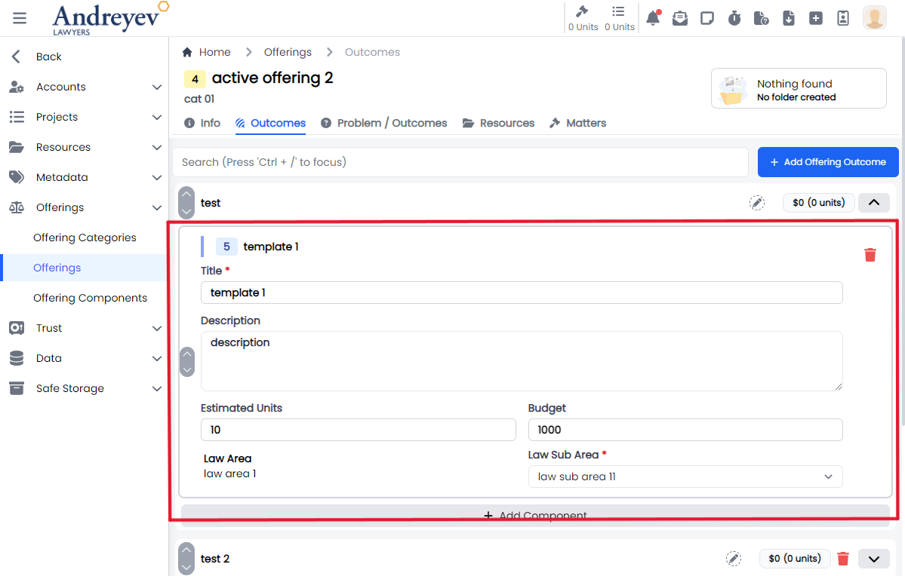
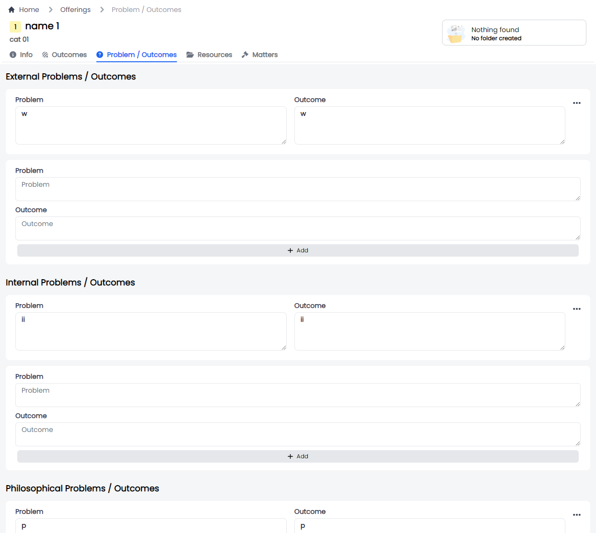

# UI Admin Components

This is A brief summary of the UI admin components being used in the system today.

## Common

The following components customises the [`modal`](./components-common.md#modal) and the [`modalForm`](./components-common.md#modalform)  components to display a modal for creating new data as an admin.

### CreateBusinessArea
This component can be used as follows:

```html
<create-business-area
  v-if="state.showCreate"
  @close="state.showCreate = false"
/>
```

The following is a visual screenshot of the modal:

### CreateCapability
This component can be used as follows:

```html
<create-capability
  v-if="state.showCreate"
  @close="state.showCreate = false"
/>
```

The following is a visual screenshot of the modal:

### CreateSubCapability
This component can be used as follows:

```html
<create-sub-capability
  v-if="state.showCreate"
  @close="state.showCreate = false"
/>
```

The following is a visual screenshot of the modal:

### CreateEmailGroup
This component can be used as follows:

```html
<create-email-group
  v-if="state.showCreate"
  @close="state.showCreate = false"
/>
```

The following is a visual screenshot of the modal:

### CreateIndustryCategory
This component can be used as follows:

```html
<create-industry-category
  v-if="state.showCreate"
  @close="state.showCreate = false"
/>
```

The following is a visual screenshot of the modal:

### CreateIndustrySubCategory
This component can be used as follows:

```html
<create-industry-sub-category
  v-if="state.showCreate"
  @close="state.showCreate = false"
/>
```

The following is a visual screenshot of the modal:

### CreateLawArea
This component can be used as follows:

```html
<create-law-area
  v-if="state.showCreate"
  @close="state.showCreate = false"
/>
```

The following is a visual screenshot of the modal:

### CreateLawSubArea
This component can be used as follows:

```html
<create-law-sub-area
  v-if="state.showCreate"
  @close="state.showCreate = false"
/>
```

The following is a visual screenshot of the modal:

### CreateOccupation
This component can be used as follows:

```html
<create-occupation
  v-if="state.showCreate"
  @close="state.showCreate = false"
/>
```

The following is a visual screenshot of the modal:

### CreateOffice
This component can be used as follows:

```html
<create-office
  v-if="state.showCreate"
  @close="state.showCreate = false"
/>
```

The following is a visual screenshot of the modal:

### CreateOrganisationType
This component can be used as follows:

```html
<create-organisation-type
  v-if="state.showCreate"
  @close="state.showCreate = false"
/>
```

The following is a visual screenshot of the modal:

### CreateSafeStorageDocumentType
This component can be used as follows:

```html
<create-safe-storage-document-type
  v-if="state.showCreate"
  @close="state.showCreate = false"
/>
```

The following is a visual screenshot of the modal:

### CreateSafeStorageSection
This component can be used as follows:

```html
<create-safe-storage-section
  v-if="state.showCreate"
  @close="state.showCreate = false"
/>
```

The following is a visual screenshot of the modal:

### CreateSegment
This component can be used as follows:

```html
<create-segment
  v-if="state.showCreate"
  @close="state.showCreate = false"
/>
```

The following is a visual screenshot of the modal:

### CreateSubSegment
This component can be used as follows:

```html
<create-sub-segment
  v-if="state.showCreate"
  @close="state.showCreate = false"
/>
```

The following is a visual screenshot of the modal:

### CreateStandardDisbursement
This component can be used as follows:

```html
<create-standard-disbursement
  v-if="state.showCreate"
  @close="state.showCreate = false"
/>
```

The following is a visual screenshot of the modal:


## Dynamic-parameters
### CreateDynamicParameter
This component customises the [`modal`](./components-common.md#modal) and the [`modalForm`](./components-common.md#modalform)  components to display a modal for creating new Dynamic Parameter.

This component can be used as follows:

```html
<create-dynamic-parameter
  v-if="state.showCreateDynamicParameterModal"
  @close="state.showCreateDynamicParameterModal = false"
/>
```

The following is a visual screenshot of the modal:

### DeleteDynamicParameter
This component customises the [`modal`](./components-common.md#modal) component to display a confirmation modal for deleting Dynamic Parameter.

This component can be used as follows:

```html
<delete-dynamic-parameter
  v-if="state.showWarningModal"
  :id="state.selectedParameter"
  @close="state.showWarningModal = false"
/>
```

The following is a visual screenshot of the modal:

### DynamicParameter
:::danger Deprecate
Using code in `ALP\App\src\views\admin\DynamicParameters.vue`
:::

This component customises the [`slideOver`](#slideover) and the component to display a side bar for editing dynamic parameter.

This component can be used as follows:

```html

```

The following is a visual screenshot of the modal:


## Email-template
### CreateEmailTemplate
This component customises the [`modal`](./components-common.md#modal) and the [`modalForm`](./components-common.md#modalform)  components to display a modal for creating new email templates.

This component can be used as follows:

```html
<create-email-template
  v-if="state.showCreate"
  @close="state.showCreate = false"
/>
```

The following is a visual screenshot of the modal:


## Entity-parameters
### CreateEntityParameter
This component customises the [`modal`](./components-common.md#modal) and the [`modalForm`](./components-common.md#modalform)  components to display a modal for creating new business area.

This component can be used as follows:

```html
<create-entity-parameter
  v-if="state.showCreateEntityParameterModal"
  :entityType="entityType"
  @close="state.showCreateEntityParameterModal = false"
/>
```

The following is a visual screenshot of the modal:

### EntityParametersList
This component sets up the page to display list of entity parameters, including the [`CreateEntityParameter`](#createentityparameter) component as an event of a button.

This component can be used directly as a router view:

```ts
component: () =>
    import(
        "@/components/ui/admin/entity-parameters/EntityParametersList.vue"
    ),
```

The following is a visual screenshot of the modal:


## Metabase
### CreateMetabaseReport
This component customises the [`modal`](./components-common.md#modal) and the [`modalForm`](./components-common.md#modalform)  components to display a modal for creating new Metabase Report.

This component can be used as follows:

```html
<create-metabase-report
  v-if="state.showCreate"
  @close="state.showCreate = false"
/>
```

The following is a visual screenshot of the modal:


## Metabase-groups
### CreateMetabaseReportGroup
This component customises the [`modal`](./components-common.md#modal) and the [`modalForm`](./components-common.md#modalform)  components to display a modal for creating new Metabase Report Group.

This component can be used as follows:

```html
<create-metabase-report-group
  v-if="state.showCreate"
  @close="state.showCreate = false"
/>
```

The following is a visual screenshot of the modal:


## Offerings
### ComponentSelector
This component customises the [`slideOver`](#slideover) and the component to display a side bar for selecting a component. Including ways to add new component or edit current components.

This component can be used as follows:

```html
<component-selector
    v-if="outcomeState.showComponentSelectorFor"
    :key="$route.params.outcomeId"
    :offering-id="id"
    :outcome-id="outcomeState.showComponentSelectorFor"
    @close="outcomeState.showComponentSelectorFor = null"
/>
```

The following is a visual screenshot of the side bar:

### CreateOffering
This component customises the [`modal`](./components-common.md#modal) and the [`modalForm`](./components-common.md#modalform)  components to display a modal for creating new offering.

This component can be used as follows:

```html
<create-offering
    v-if="state.showCreateOffering"
    @close="state.showCreateOffering = false"
/>
```

The following is a visual screenshot of the modal:

### CreateOfferingCategory
This component customises the [`modal`](./components-common.md#modal) and the [`modalForm`](./components-common.md#modalform)  components to display a modal for creating new offering category.

This component can be used as follows:

```html
<create-offering-category
    v-if="state.showCreateOfferingCategory"
    @close="state.showCreateOfferingCategory = false" 
/>
```

The following is a visual screenshot of the modal:

### CreateOfferingComponent
This component customises the [`modal`](./components-common.md#modal) and the [`modalForm`](./components-common.md#modalform)  components to display a modal for creating new offering component.

This component can be used as follows:

```html
<create-offering-component
    v-if="state.showCreateComponent"
    @close="state.showCreateComponent = false"
/>
```

The following is a visual screenshot of the modal:

### CreateOfferingOutcome
This component customises the [`modal`](./components-common.md#modal) and the [`modalForm`](./components-common.md#modalform)  components to display a modal for creating new offering outcome.

This component can be used as follows:

```html
<create-offering-outcome
  v-if="state.showCreate"
  @close="state.showCreate = false"
/>
```

The following is a visual screenshot of the modal:

### InlineOfferingComponent
This component creates and displays each offering outcome component integrating the [`UpDownSwitch`](./components-common.md#updownswitch) component and the [`InlineInput`](./components-input.md#inlineinput) component to allow inline editing funtionality.

This component can be used as follows:

```html
<inline-offering-component
  v-for="component in components"
  :key="component.id"
  :offering-id="id"
  :outcome-id="outcome.id"
  :component="component"
/>
```

The following is a visual screenshot of the component:

### InlineOfferingOutcome
This component creates and displays each offering outcome integrating the [`UpDownSwitch`](./components-common.md#updownswitch) component and the [`InlineInput`](./components-input.md#inlineinput) component to allow inline editing funtionality.

This component can be used as follows:

```html
<inline-offering-outcome
  :id="id"
  :outcome="item"
  @add-component="outcomeState.showComponentSelectorFor = $event"
/>
```

The following is a visual screenshot of the component:

### InlineOfferingOutcomeObjectionGuarantee
:::danger Deprecate
:::
### InlineOfferingProblemOutcome
This component customises the [`modal`](./components-common.md#modal) and the [`modalForm`](./components-common.md#modalform)  components to display a modal for creating new business area.

This component can be used as follows:

```html
<create-business-area
  v-if="state.showCreate"
  @close="state.showCreate = false"
/>
```

The following is a visual screenshot of the modal:

### MergeOffering
This component customises the [`modal`](./components-common.md#modal) and the [`modalForm`](./components-common.md#modalform)  components to display a modal for creating new business area.

This component can be used as follows:

```html
<create-business-area
  v-if="state.showCreate"
  @close="state.showCreate = false"
/>
```

The following is a visual screenshot of the modal:


## Project-templates

### CreateProjectTemplate

### CreateProjectTemplateScheduler

### InlineProjectTemplateTask

### InlineProjectTemplateTaskStep

### ProjectTemplateTask

### ProjectTemplateTaskMetadata


## Resource-urls

### CreateResourceUrl


## Roles

### CreateRole

### Role


## Sprints

### CreateSprint


## Standard-tasks

### CreateStandardTask

### InlineStandardTaskStep

### StandardTask

### StandardTaskMetadata


## Trusts

### CreateTrustAccount


## Users

### CreateRemuneration

### CreateUser


