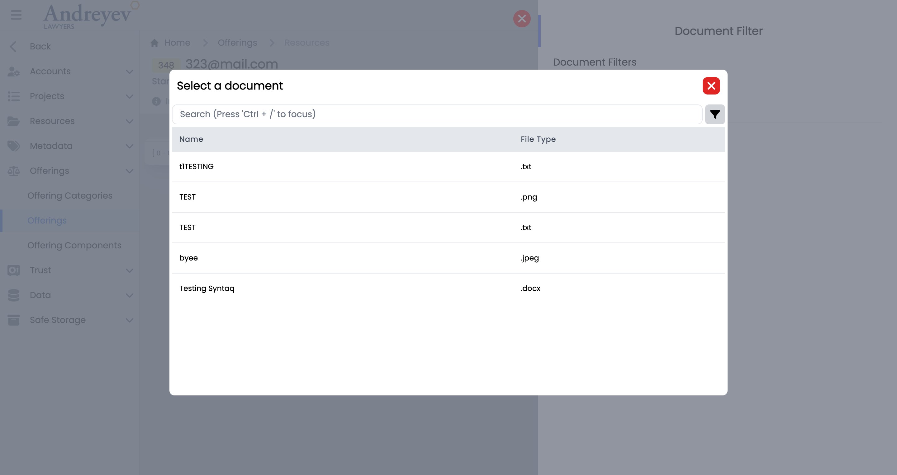

# UI User Components

This Is a brief overview of the UI ***User*** Components being used in the system today.
<!-- ::: tip  Updated at 2023 Q1
::: -->


## GlobalModals

This file includes all commonly used modals in the ALP system to allow easier access to the modals.

This component dynamically renders a different child component based on the value of `currentModalComponent`.

`currentModalComponent` is a computed property that uses the **Vuex store's** `ModalType` enum to determine which child component to render. The enum defines a list of different modal types, each corresponding to a specific child component.

When a modal is triggered, a mutation is dispatched to the **Vuex store** to set the active modal type. The `currentModalComponent` computed property then updates based on the new state in the store, causing the appropriate child component to be rendered inside the modal window.

This can be used as follows:

```html
<template>
  <div>
    <a @click="showModal(ModalType.CreateContact, {})">
      <font-awesome-icon icon="fa-solid fa-id-card fa-2xl">
      </font-awesome-icon>
      Create Contact
    </a>

    <global-modals />
  </div>
</template>

<script>
import { useStore } from "vuex";
import GlobalModal from "@/components/GlobalModal.vue";

export default {
  components: {
    GlobalModal,
  },
  setup() {
    const store = useStore();

    function showModal(type: ModalType, props: Record<string, unknown>) {
      store.dispatch(ModalStore.actions.SHOW_MODAL, {
        modal: type,
        props
      });
    }
  }
}
```

## Clients
### CreateClient

This is a [`modal`](components-common.md#modal) using [`modalform`](components-common.md#modalform) to customise for creating a new Client.

This can be used according to [`GlobalModals`](#globalmodals).

The following is a visual of this component at work.

 
## Contacts
### CreateContact
This is a [`modal`](components-common.md#modal) using [`modalform`](components-common.md#modalform) to customise for creating a new Contact.

This can be used according to [`GlobalModals`](#globalmodals).

The following is a visual of this component at work.

### ShowACUnsubscribe
This is a [`modal`](components-common.md#modal) using [`modalform`](components-common.md#modalform) to customise for unsubscribing newsletters for a contact providing reasons.

This can be used according to [`GlobalModals`](#globalmodals).

The following is a visual of this component at work.


## Directory
### EmailGroup
This component is for fetching and displaying Email Groups, with group name and description of the group. This component enables adding of whole group to email recipient.

This component can be used as follows:
```html
<email-group
    v-if="state.selectedOption == 'groups'"
    :search = "state.search"
/>
```
The following is a visual of this component at work.

### People
This component is for fetching and displaying People, with Name, Rate, Email and description of person. This component enables adding People to email recipient.

This component can be used as follows:
```html
<people
    v-if="state.selectedOption == 'people'"
    :search = "state.search"
/>
```
The following is a visual of this component at work.


## Documents
### DocumentList
This component customises the [`Document`](#document) window and [`DocumentActions`](#documentactions) to list a table of documents.

This component can be used as follows:

```html
<document-list
  class="flex-1 mt-2"
  :loading="loading"
  :uploading="state.uploading"
  :documents="items"
  :documents-count="count"
  :can-create="can('ContactDocument.Create')"
  :can-edit="can('ContactDocument.Edit')"
  :can-delete="can('ContactDocument.Delete')"
  @fetch="fetch"
  @upload="uploadContactDocuments"
  @create-from-resource="createFromResource"
  :contactId = id
/>
```
The following is a visual of this component at work.

### Document
This component customises the [`SlideOver`](#slideover) window for managing a document draft histories.

This component can be used as follows:

```html
<document
  v-if="state.selectedDocumentId"
  :key="state.selectedDocumentId"
  :id="state.selectedDocumentId"
  :can-edit="canEdit"
  :can-delete="canDelete"
  @updated="fetchDocuments"
  @close="
    () => {
      state.selectedDocumentId = null;
      $emit('closed')
    }
  "
/>
```
The following is a visual of this component at work.

### DocumentActions
This component is for listing each document in the document list, with actions like download, add to reminder, [`RequestDocumentReview`](#requestdocumentreview), attach to email and more.

This component can be used as follows:
```html
<document-actions
  :document="item.document"
  :can-edit="false"
  :can-delete="false"
  :can-add-reminder="false"
  :can-request-review="false"
  @updated="fetchDocument"
  @deleted="$emit('close')"
/>
```

The following is a visual of this component at work.

### DocumentFilters

This component customises the [`SlideOver`](#slideover) window for managing filters in document viewing.

This component can be used as follows:

```html
<document-filters
  v-if="state.showDocumentFilters"
  class="z-50"
  v-model:matchAny="state.matchAny"
  v-model:filterParameters="state.filterParameters"
  @close="state.showDocumentFilters = false"
/>
```
The following is a visual of this component at work.

:::danger Possible Bug 
:::
### ActiveDocuments
This component shows a floating container of the active documents, displays 'No Active Document Found' when empty.

This component can be used as follows:
```html
<active-documents v-if="tab == 'active'" />
```
The following is a visual of this component at work.

### RequestDocumentReview
This is a [`modal`](components-common.md#modal) using [`modalform`](components-common.md#modalform) to customise for requesting a Staff for a document review with an included message.

This can be used according to [`GlobalModals`](#globalmodals).

The following is a visual of this component at work.

### ReceivedDocumentReviewRequests
This component is to display a floating container to show the received requests for document reviews as a reviewer.

This component can be used as follows:

```html
<received-document-review-requests v-if="tab == 'received'" />
```

The following is a visual of this component with documents and while empty.


### RequestedDocumentReviewRequests
This component is to display a floating container to show the requested document reviews and their status.

This component can be used as follows:

```html
<requested-document-review-requests v-if="tab == 'requested'" />
```
The following is a visual of this component with documents and while empty.


### CompleteDocumentReview
This is a [`modal`](components-common.md#modal) using [`modalform`](components-common.md#modalform) to customise for completing document review providing a message.

This can be used according to [`GlobalModals`](#globalmodals).

The following is a visual of this component at work.

### ResourceSelector
This component is to display a resource selector with search bar and filtering, using [`modal`](components-common.md#modal).

This component can be used as follows:

```html
<resource-selector
  v-if="resourceState.showResourceSelector"
  @create="addDocumentResource($event)"
  @close="resourceState.showResourceSelector = false"
/>
```

The following is a visual of this component at work.

### SyntaqResourceSelector
This component is to display a Syntaq resource selector with a search bar, using [`modal`](components-common.md#modal).

This component can be used as follows:

```html
<syntaq-resource-selector
  v-if="resourceState.showSyntaqSelector"
  @create="addSyntaqFormResource($event)"
  @close="resourceState.showSyntaqSelector = false"
/>
```

The following is a visual of this component at work.


## Emails
### EmailList
This component is for displaying the list of emails, with a search and filter function. It also includes a multi-select function that allows actions to emails to be done in batches.

This component can be used as follows:

```html
<email-list
  class="w-full"
  :getter="EmailStore.getters.GET_INBOX_EMAILS"
  :query="EmailStore.getters.GET_INBOX_EMAILS"
  :multiselectTrigger="true"
  :selectedEmail="true"
  @selected="$router.push({ name: 'Inbox Email', params: $event })"
  @click="selectMethod($event)"
/>
```
The following is a visual of this component at work.

### EmailDisplay
This component is to display a email in a container, including options for assigning email to matter/project, convert to pdf, and other common email options.

This component can be used as follows:
```html
<email-display
  v-if="!email?.threadEmail.length"
  can-import
  :email="email"
  :email-type="'Matter'"
  :entity-number = id
  @download-attachment="downloadAttachment"
  @import-attachment="importAttachment"
  @preview-attachment="previewAttachment"
  @close="$emit('close')"
/>
```
The following is a visual of this component at work.


## Feedback
### CreateBugReport
This is a [`modal`](components-common.md#modal) using [`modalform`](components-common.md#modalform) to customise for creating a bug report with description, priority drop down selection and file uploads.

This can be used according to [`GlobalModals`](#globalmodals).

The following is a visual of this component at work.

### CreateSuggestion
This is a [`modal`](components-common.md#modal) using [`modalform`](components-common.md#modalform) to customise for submitting a suggestion with description, type drop down selection and file uploads.

This can be used according to [`GlobalModals`](#globalmodals).

The following is a visual of this component at work.

### UploadDocument
This component is for the 'drag and drop' file upload function of the two components above, [`CreateBugReport`](#createbugreport) and [`CreateSuggestion`](#createsuggestion).

This is used as follows:
```html
  <UploadDocument @drop.prevent="drop" />
```

## Invoices
### CreateFixedPriceItem

This is a [`modal`](components-common.md#modal) using [`modalform`](components-common.md#modalform) to customise for creating fixed price items.

This component can be used as follows:

```html
<create-fixed-price-item
  v-if="state.showCreateFixedPriceItem"
  :id="id"
  @close="state.showCreateFixedPriceItem = false"
/>
```

The following is a visual of this component at work.

### CreateInvoice
This is a [`modal`](components-common.md#modal) using [`modalform`](components-common.md#modalform) to customise for creating a new invoice.

This can be used according to [`GlobalModals`](#globalmodals).

The following is a visual of this component at work.

### EditInvoiceNote
This is a [`modal`](components-common.md#modal) using [`modalform`](components-common.md#modalform) to customise for updating existing invoice notes.

This can be used according to [`GlobalModals`](#globalmodals).

The following is a visual of this component at work.

### InlineInvoice
This component is to display an invoice in a line for a page of list of invoices. This line of invoice uses colored badges to differentiate type and status of the invoice. This component also allows downloading as pdf, sending reminders and more.

This component can be used as follows:
```html
<inline-invoice
  class="mb-3 transition duration-200 shadow-lg"
  v-for="item in items"
  :key="item.id"
  :invoice="item"
  @load-more="fetch"
/>
```
The following is a visual of this component at work.

### InvoiceDisbursementSelector
This component customises the [`SlideOver`](#slideover) window for selecting a disbursement.

This component can be used as follows:

```html
<invoice-disbursement-selector
  v-if="state.showDisbursementSelector"
  :key="$route.params.id"
  :id="id"
  @close="state.showDisbursementSelector = false"
/>
```
The following is a visual of this component at work.

### InvoiceTimeEntrySelector
This component customises the [`SlideOver`](#slideover) window for managing time entries to include in the invoice.

This component can be used as follows:

```html
<invoice-time-entry-selector
  v-if="state.showTimeEntrySelector"
  :key="$route.params.id"
  :id="id"
  @close="state.showTimeEntrySelector = false"
/>
```
The following is a visual of this component at work.

### UpdateInvoiceDate
This is a [`modal`](components-common.md#modal) using [`modalform`](components-common.md#modalform) to customise for updating invoice date.

This component can be used as follows:

```html
<update-invoice-date
  v-if="state.showUpdateInvoiceDate"
  :id="invoice.id"
  @close="state.showUpdateInvoiceDate = false"
/>
```

The following is a visual of this component at work.


## Layout
### ActionMultiselect
:::danger Deprecated
:::
### AdminMenu

This component is to display the admin side menu, with toggle to hide sub sections, and most importantly, navigation links to the sections pages using [`NavLink`](components-common.md#navlink).

This component can be used as follows:

```html
<admin-menu
  v-else-if="state.showMenu === 'admin'"
  class="w-full"
  @navigated="state.expanded = false"
/>
```

The following is a visual of this component at work.

### SlideOver

This component can be used as follows:

```html
<slide-over
  heading="Matter Filters"
  v-if="viewState.showMatterFilters"
  @close="viewState.showMatterFilters = false"
>
</slide-over>
```
The following is a visual of this component at work.

### ComponentSlideOver
This component is similar to that of [`SlideOver`](#slideover), with slight changes to color and side of the slide over window.

Refer to [`SlideOver`](#slideover) for usage example.
### ProjectTaskSlideOver
This component is similar to that of [`SlideOver`](#slideover), with slight changes to color and side of the slide over window.

Refer to [`SlideOver`](#slideover) for usage example.

The following is a visual of this component at work.

### Detail
This component renders a container to contain details in a box with grey background.

This component can be used by just wrapping the contents just like that of a `div` component.

The following is a visual of this component at work.

### MasterDetail
This component is for rendering the breadcrumbs of the currently displayed page in the main container. This is very useful in helping the user visualise and navigate 
This is usually used by wrapping the whole page. 

This component can be used by just wrapping the contents just like that of a `div` component.

The following is a visual of this component at work.

### MainMenu
This component is to render the whole main menu on the left side of the page. 

This component can be used as follows:

```html
<main-menu
    :hideMenu="msg"
    v-if="state.showMenu === 'main'"
    @navigated="navigated"
/>
```

The following is a visual of this component at work.

### DocumentMenu
This component is to render the menu for documents that includes [`ActiveDocuments`](#activedocuments),[`ReceivedDocumentReviewRequests`](#receiveddocumentreviewrequests) and [`RequestedDocumentReviewRequests`](#requesteddocumentreviewrequests).

This component can be used as follows:

```html
<document-menu v-else-if="state.showMenu == 'documents'" />
```
The following is a visual of this component at work.

### DownloadMenu
This component is to render the downloading menu to list current downloading jobs. 

This component can be used as follows:

```html
<download-menu v-else-if="state.showMenu == 'downloads'" />
```

The following is a visual of this component at work.

### EmailMenu
This component is to render the new email floating page when clicking the top menu email option.

This component can be used as follows:

```html
<email-menu v-else-if="state.showMenu === 'emails'" />
```
The following is a visual of this component at work.

### NotificationMenu
This component is to render the floating notification menu window. 

This component can be used as follows:

```html
<notification-menu v-else-if="state.showMenu === 'notifications'" />
```

The following is a visual of this component at work.

### ReminderMenu
This component is to render the floating reminder menu window. 

This component can be used as follows:

```html
<reminder-menu v-else-if="state.showMenu === 'reminders'" />
```

The following is a visual of this component at work.

### TimerMenu
This component is to render the floating timer menu window. 

This component can be used as follows:

```html
<timer-menu v-else-if="state.showMenu === 'timers'" />
```

The following is a visual of this component at work.

### StaffDirectory
This component customises the [`SlideOver`](#slideover) window for rendering the staff directory.

This component can be used as follows:

```html
<staff-directory
  :isOpen="open"
  :isLockIcon="true"
  :currentLockState="state.isStaffDirectory"
  :lockIconClick="handleStaffDirectoryLockIconClick"               
/>
```
The following is a visual of this component at work.

### SideBar
This component is used to render the group of menu items on the top right hand corner, including [`DocumentMenu`](#documentmenu),[`DownloadMenu`](#downloadmenu),[`EmailMenu`](#emailmenu),[`NotificationMenu`](#notificationmenu), [`ReminderMenu`](#remindermenu),    , and [`TimerMenu`](#timermenu)[`StaffDirectory`](#staffdirectory).

This component can be used as follows:

```html
<side-bar
  :handleHover="handleExpand"
  :handleMouseLeave="handleClose"
  class="md:flex flex-shrink-0 flex-grow-0"
  :msg="state.msg"
  :showAdminMenu="state.isShowAdminMenu"
  :handleMobileviewNatigation="handleMobileviewNatigation"
/>
```
<!-- :::danger Bug
wrong spelling in code
::: -->
The following is a visual of this component at work.

### Layout
This component renders the overall page for the main layout, with the top and side navigation. This consists of the [`MainMenu`](#mainmenu) for the side navigation; [`SideBar`](#sidebar) used for the top navigation menu.  

This component can be used as follows:
```ts
  redirect: { name: "Dashboard" },
  component: () => import("@/components/ui/layout/Layout.vue"),
```
The following is a visual of this component at work.

### FeedbackButton
:::danger Deprecated
:::
### NavBar
:::danger Deprecated
Switched to sidebar
:::
### QuickLinks
:::danger Deprecated
:::


## MailRegister
### CreateIncomingMail
This is a [`modal`](components-common.md#modal) using [`modalform`](components-common.md#modalform) to customise for registering new incoming mail.

This can be used according to [`GlobalModals`](#globalmodals).

The following is a visual of this component at work.

### CreateOutgoingMail
This is a [`modal`](components-common.md#modal) using [`modalform`](components-common.md#modalform) to customise for registering outgoing mail.

This can be used according to [`GlobalModals`](#globalmodals).

The following is a visual of this component at work.


## Matters
### AddMatterNote
This is a [`modal`](components-common.md#modal) using [`modalform`](components-common.md#modalform) to customise for adding a new matter note.

This can be used according to [`GlobalModals`](#globalmodals).

The following is a visual of this component at work.

### AddMatterOutcome
This component renders a [`modal`](components-common.md#modal) component for selecting an outcome to add to the matter according to the type of matter.

This component can be used as follows:

```html
<add-matter-outcome
  v-if="state.showAddOutcomes"
  :id="id"
  @close="state.showAddOutcomes = false"
/>
```

The following is a visual of this component at work.

### AssignEmailToMatter
This is a [`modal`](components-common.md#modal) using [`modalform`](components-common.md#modalform) to customise for assigning email to chosen matter.

This can be used according to [`GlobalModals`](#globalmodals).

The following is a visual of this component at work.

### CreateDisbursement
This component renders a [`modal`](components-common.md#modal) using [`modalform`](components-common.md#modalform), for filling in form to create a disbursement.

This component can be used as follows:

```html
<create-disbursement
  :matter-id="id"
  v-if="state.showCreate"
  @close="state.showCreate = false"
/>
```
The following is a visual of this component at work.

### CreateMatter
This is a [`modal`](components-common.md#modal) using [`modalform`](components-common.md#modalform) to customise for creating a new matter.

This can be used according to [`GlobalModals`](#globalmodals).

The following is a visual of this component at work.

### CreateTrustTransactionRequest
This component renders a [`modal`](components-common.md#modal) using [`modalform`](components-common.md#modalform), for creating a Trust Transaction Request.

This component can be used as follows:

```html
<create-trust-transaction-request
  v-if="state.showCreate"
  :id="id"
  @close="state.showCreate = false"
/>
```

The following is a visual of this component at work.

### EditContactNote
This is a [`modal`](components-common.md#modal) using [`modalform`](components-common.md#modalform) to customise for editing an existing contact note.

This can be used according to [`GlobalModals`](#globalmodals).

The following is a visual of this component at work.

### EditMatterNote
This is a [`modal`](components-common.md#modal) using [`modalform`](components-common.md#modalform) to customise for editing an existing matter note.

This can be used according to [`GlobalModals`](#globalmodals).

The following is a visual of this component at work.

### InlineMatter
This component is to display a Matter in a line for a page of list of Matters in "My Matters Report". 
This line of Matter renders an overview of the matter, including MatterId in coloured badge, latest note of matter, status of matter and more. 

This component can be used as follows:

```html
<inline-matter
  class="mb-3 transition duration-200 shadow-lg"
  v-for="item in items"
  :key="item.id"
  :matter="item"
/>
```

The following is a visual of this component at work.

### InlineMatterComponent
This component renders the inline matter outcome component as shown in the visual below. This component includes a `multiUserSelector` to assign the component to a staff member, `timer` to record time entries as well as a `dueDate` for the component.

This component can be used as follows:

```html
<inline-matter-component
  v-for="component in components"
  :key="component.id"
  class="mb-1 transition duration-200"
  :matter-id="matterId"
  :outcome-id="outcome.id"
  :component="component"
  @updated="$emit('updated')"
/>
```
The following is a visual of this component at work.

### InlineMatterOutcome
This component renders a container to hold the [`InlineMatterComponent`](#inlinemattercomponent) according to their outcomes.

This component can be used as follows:

```html
<inline-matter-outcome
  class="my-1 mx-2 transition duration-200"
  v-for="item in matterOutcomes"
  :key="item.id"
  :matter-id="id"
  :outcome="item"
/>
```

The following is a visual of this component at work.

### MatterComponentTimeEntries
This component renders a [`modal`](components-common.md#modal) using [`modalform`](components-common.md#modalform) for creating time entries for a matter outcome component.

This component can be used as follows:

```html
<matter-component-time-entries
  :matter-id="id"
  :outcome-id="outcomeId"
  :id="componentId"
/>
```
The following is a visual of this component at work.

### MatterTimeEntriesForMatter
This component renders the page under each matter that shows all of the matter time entries of the matter.

This component can be used as follows:

```html
<matter-time-entries-for-matter
  v-if="state.selectedType == 'matter'"
  :id="id"
  :invoiced="state.invoiced"
  :billable-type="state.billableType"
  :user="state.user"
  :search="state.search"
  @selected="getSelectedTimeEntry($event)"
/>
```
The following is a visual of this component at work.

### SalesTimeEntriesForMatter
This component renders the page under each matter that shows all of the sales time entries of the matter.

This component can be used as follows:

```html
<sales-time-entries-for-matter
  v-if="state.selectedType == 'sales'"
  :id="id"
  :user="state.user"
  :search="state.search"
  @selected="getSelectedTimeEntry($event)"
/>
```

The following is a visual of this component at work.

### MatterTrustRequests
This component renders the page under each matter that shows all of the trust requests of the matter.

This component can be used as follows:

```html
<matter-trust-requests 
  v-if="state.selectedType == 'requests'" 
  :id="id" 
/>
```
The following is a visual of this component at work.

### MatterTrustTransactions
This component renders the page under each matter that shows all of the trust transactions of the matter.

This component can be used as follows:

```html
<matter-trust-transactions
  v-if="state.selectedType == 'transactions'"
  :id="id"
/>
```

The following is a visual of this component at work.

### ReassignEmails
:::danger Deprecated
:::
<!-- This is a [`modal`](components-common.md#modal) using [`modalform`](components-common.md#modalform) to customise for registering new incoming mail.

This can be used according to [`GlobalModals`](#globalmodals).

The following is a visual of this component at work.
 using [`modalform`](components-common.md#modalform) to customise for updating status of a matter.

This can be used according to [`GlobalModals`](#globalmodals).

The following is a visual of this component at work.


## Offerings
### InlineOfferingComponent

This component renders the inline offering component under an offering outcome. 

This component can be used as follows:

```html
<inline-offering-component
  v-for="component in components"
  :key="component.id"
  :offering-id="id"
  :outcome-id="outcome.id"
  :component="component"
/>
```
The following is a visual of this component at work.

### InlineOfferingOutcome
This component renders the inline offering outcome under an offering.

This component can be used as follows:

```html
<inline-offering-outcome
  class="flex-1"
  :class="{
    'border-green-300 bg-opacity-25 bg-green-300 hover:bg-red-100 hover:border-red-300':
    isSelected(item)
  }"
  :id="id"
  :outcome="item"
  @selected="selectOutcome"
/>
```
The following is a visual of this component at work.

### InlineOfferingOutcomeObjectionGuarantee
:::danger Deprecated
:::
### InlineOfferingProblemOutcome
This component renders the inline offering problem outcome under an offering.  

This component can be used as follows:

```html
<inline-offering-problem-outcome
  v-for="problemOutcome in problemOutcomes.filter(
    (o) => o.type == type.value
  )"
  :key="problemOutcome.id"
  :id="id"
  :problem-outcome="problemOutcome"
  disabled
/>
```

The following is a visual of this component at work.


## Organisations
### CreateOrganisation
This is a [`modal`](components-common.md#modal) using [`modalform`](components-common.md#modalform) to customise for creating a new organisation.

This can be used according to [`GlobalModals`](#globalmodals).

The following is a visual of this component at work.

### EditOrganizationNote
This is a [`modal`](components-common.md#modal) using [`modalform`](components-common.md#modalform) to customise for editing an existing organisation note.

This can be used according to [`GlobalModals`](#globalmodals).

The following is a visual of this component at work.


## PqeAdjustment
### CreatePQEAdjustment
<!-- :::danger Pending confirmation
Should this be in admin/user instead?
::: -->
This is a [`modal`](components-common.md#modal) using [`modalform`](components-common.md#modalform) to customise for creating PQE adjustment.

This can be used according to [`GlobalModals`](#globalmodals).

The following is a visual of this component at work.


## Projects
### AssignEmailToProject
This is a [`modal`](components-common.md#modal) using [`modalform`](components-common.md#modalform) to customise for assigning email to chosen project.

This can be used according to [`GlobalModals`](#globalmodals).

The following is a visual of this component at work.

### CreateProject
This is a [`modal`](components-common.md#modal) using [`modalform`](components-common.md#modalform) to customise for creating a new project.

This can be used according to [`GlobalModals`](#globalmodals).

The following is a visual of this component at work.

### CreateProjectTask
This is a [`modal`](components-common.md#modal) using [`modalform`](components-common.md#modalform) to customise for creating a new project task.

This can be used according to [`GlobalModals`](#globalmodals).

The following is a visual of this component at work.

### EditProjectNote
This is a [`modal`](components-common.md#modal) using [`modalform`](components-common.md#modalform) to customise for editing an existing project note.

This can be used according to [`GlobalModals`](#globalmodals).

The following is a visual of this component at work.

### InlineProject
This component renders each inline projects under my projects. This includes function for inline editing of names, owners, tasks and other functions such as changing status of the project. 

This component can be used as follows:

```html
<inline-project
  class="mb-3 mx-1 transition duration-200 shadow-lg"
  :project="value"
  @task-selected="taskSelected(value.id, $event)"
/>
```
The following is a visual of this component at work.

### InlineProjectTask
This component renders each inline projects task under [`InlineProject`](#inlineproject). This includes function for inline editing of take names, assigning staff members, setting status of task and a timer for time entry records. 

This component can be used as follows:

```html
<inline-project-task
  class="mt-1 transition duration-200"
  v-for="item in projectTasks"
  :key="item.id"
  :project-id="project.id"
  :project-task="item"
  @selected="$emit('task-selected', item.id)"
  @updated="fetchProjectTasks"
/>
```

The following is a visual of this component at work.

### InlineProjectTaskCard
This component renders a task card similar to that of a kanban to be viewed and dragged for rearranging. [`AlpDraggable`](components-common.md#alpdraggable) component will be needed to allow dragging. 

This component can be used as follows:

```html
<inline-project-task-card
  :project-id="id"
  :project-task="value"
  @updated="fetchProjectTasks"
  @card-clicked="cardClicked"
>
</inline-project-task-card>
```
The following is a visual of this component at work.

### InlineProjectTaskStep
This component renders an inline task step under the [`ProjectTask`](#projecttask) that allows adding of resources.

This component can be used as follows:

```html
<inline-project-task-step
  :project-id="projectId"
  :project-task-id="id"
  :project-task-step="value"
  class="flex items-center"
  :key="value.id"
  :is-steps-check-list="state.isStepsCheckList"
  @updated="$emit('stepUpdated')"
/>
```

The following is a visual of this component at work.

### ProjectTask
This component customises the [`ProjectTaskSlideOver`](#projecttaskslideover) window for managing permissions in the system of a role.

This component can be used as follows:

```html
<project-task
  v-if="state.selectedProjectId && state.selectedTaskId"
  :key="state.selectedTaskId"
  :project-id="state.selectedProjectId"
  :id="state.selectedTaskId"
  @close="taskSelected(null, null)"
/>
```
The following is a visual of this component at work.

### ProjectTaskMetadata
This component renders the metadata section in the [`ProjectTask`](#projecttask).

This component can be used as follows:

```html
<project-task-metadata :project-id="projectId" :id="id" />
```

The following is a visual of this component at work.

### ProjectTimeEntriesForProject
This component renders a [`modal`](components-common.md#modal) using [`modalform`](components-common.md#modalform), for filling in form to create a time entry for project, under Projects > Time entries.

This component can be used as follows:

```html
<project-time-entries-for-project
  :id="id"
  :user="state.user"
  :search="state.search"
  @selected="getSelectedTimeEntry($event)"
/>
```

The following is a visual of this component at work.


## Relationships
### CreateOrganisationRelationship
This component renders a [`modal`](components-common.md#modal) using [`modalform`](components-common.md#modalform), for creating a new organisation relationship.

This component can be used as follows:

```html
<create-organisation-relationship
  v-if="state.showCreateRelationshipModal"
  :id="id"
  @close="closeCreate()"
/>
```

The following is a visual of this component at work.

### CreateRelationship
This is a [`modal`](components-common.md#modal) using [`modalform`](components-common.md#modalform) to customise for filling in contact relationships, Family, Referrer and Professional.

This can be used according to [`GlobalModals`](#globalmodals).

The following is a visual of this component at work.


## Reminders
### CreateReminder
This is a [`modal`](components-common.md#modal) using [`modalform`](components-common.md#modalform) to customise for creating a new reminder with a Due Date and Resource selector.

This can be used according to [`GlobalModals`](#globalmodals).

The following is a visual of this component at work.


## Resource-urls
### ResourceUrlSelector
This component renders a [`modal`](components-common.md#modal) for selecting a resource URL.

This component can be used as follows:

```html
<resource-url-selector
  v-if="resourceState.showUrlSelector"
  @selected="addUrlResource($event)"
  @close="resourceState.showUrlSelector = false"
/>
```

The following is a visual of this component at work.


## SafeStorage
### CreateContactSafeStorage
This component renders a [`modal`](components-common.md#modal) using [`modalform`](components-common.md#modalform), for creating a safe storage for a contact.

This component can be used as follows:

```html
<create-contact-safe-storage
  v-if="state.showCreate"
  :contact_id="id"
  @close="state.showCreate = false"
/>
```

The following is a visual of this component at work.

### CreateOrganisationSafeStorage
This component renders a [`modal`](components-common.md#modal) using [`modalform`](components-common.md#modalform), for creating a safe storage for an organisation.

This component can be used as follows:

```html
<create-organisation-safe-storage
  v-if="state.showCreate"
  :organisation_id="id"
  @close="state.showCreate = false"
/>
```

The following is a visual of this component at work.


## Time-tracking
### CreateTimeEntry
This is a component calling [`CreateTimeEntryForm`](#createtimeentryform) into a [`modal`](components-common.md#modal) to customise for creating a new time entry.

This can be used according to [`GlobalModals`](#globalmodals).

The following is a visual of this component at work.

### CreateTimeEntryForm
This component consists of the form to fill for [`CreateTimeEntry`](#createtimeentry) using the [`modalform`](components-common.md#modalform) component.
### CreateTimeEntryForMatter
This is a component calling [`CreateTimeEntryFormForMatter`](#createtimeentryformformatter) into a [`modal`](components-common.md#modal) to customise for creating a new time entry for matter as well as for sales.

This can be used according to [`GlobalModals`](#globalmodals).

The following is a visual of this component at work.

### CreateTimeEntryFormForMatter
This component consists of the form to fill for [`CreateTimeEntryForMatter`](#createtimeentryformatter) using the [`modalform`](components-common.md#modalform) component. This component consists of both forms for matter and for sales.
### CreateTimeEntryForProject
This is a component calling [`CreateTimeEntryFormForProject`](#createtimeentryformforproject) into a [`modal`](components-common.md#modal) to customise for creating a new time entry inside a project.

This can be used according to [`GlobalModals`](#globalmodals).

The following is a visual of this component at work.

### CreateTimeEntryFormForProject
This component consists of the form to fill for [`CreateTimeEntryForProject`](#createtimeentryforproject) using the [`modalform`](components-common.md#modalform) component.
### InlineAddMatterTimeEntries
This component renders a inline adding of time entry for matter. This component is under "**Time Tracking**" > "**Time Entries**" section. It adopts the inline creating instead of the [`modal`](components-common.md#modal) in the [`CreateTimeEntryForMatter`](#createtimeentryformatter).

This component can be used as follows:

```html
<inline-add-matter-time-entries
  :start-date="startDate"
  :end-date="endDate"
/> 
```

The following is a visual of this component at work.

### InlineAddProjectTimeEntries
This component renders a inline adding of time entry for project. This component is under "**Time Tracking**" > "**Time Entries**" section. It adopts the inline creating instead of the [`modal`](components-common.md#modal) in the [`CreateTimeEntryForProject`](#createtimeentryforproject).

This component can be used as follows:

```html
<inline-add-project-time-entries 
  :start-date="startDate"
  :end-date="endDate"
/> 
```

The following is a visual of this component at work.

### InlineAddSalesTimeEntries
This component renders a inline adding of time entry for sales. This component is under "**Time Tracking**" > "**Time Entries**" section. It adopts the inline creating instead of the [`modal`](components-common.md#modal) in the [`CreateTimeEntryForMatter`](#createtimeentryformatter).

This component can be used as follows:

```html
<inline-add-sales-time-entries
  :start-date="startDate"
  :end-date="endDate"
/>
```

The following is a visual of this component at work.

### InlineMatterTimeEntries
This component renders each inline matter time entries under "**Time Tracking**" > "**Time Entries**" > "**Matter**" section.  

This component can be used as follows:

```html
<inline-matter-time-entries
  class="mb-1 transition duration-200 mx-2"
  v-for="item in items"
  :key="item.id"
  :matterTimeEntry="item"
  @load-more="fetch"
  @selected="$emit('selected', $event)"
/>
```

The following is a visual of this component at work.

### InlineProjectTimeEntries
This component renders each inline matter time entries under "**Time Tracking**" > "**Time Entries**" > "**Project**" section.  

This component can be used as follows:

```html
<inline-project-time-entries
  class="mb-1 transition duration-200 mx-2"
  v-for="item in items"
  :key="item.id"
  :projectTimeEntry="item"
  @load-more="fetch"
  @selected="$emit('selected', $event)"
/>
```

The following is a visual of this component at work.

### InlineSalesTimeEntries
This component renders each inline matter time entries under "**Time Tracking**" > "**Time Entries**" > "**Sales**" section.  

This component can be used as follows:

```html
<inline-sales-time-entries
  class="mb-1 transition duration-200 mx-2"
  v-for="item in items"
  :key="item.id"
  :salesTimeEntry="item"
  @load-more="fetch"
  @selected="$emit('selected', $event)"
/>
```

The following is a visual of this component at work.

### MatterTimeEntries
This component renders the page for matter time entries that includes both the [`InlineAddMatterTimeEntries`](#inlineaddmattertimeentries) for adding new matter time entry as well as the [`InlineMatterTimeEntries`](#inlinemattertimeentries).

This component can be used as follows:

```html
<matter-time-entries
  v-if="state.selectedType == 'matter'"
  :search="state.search"
  :start-date="startDate"
  :end-date="endDate"
  :invoiced="state.invoiced"
  :billable-type="state.billableType"
  :matter="state.matter"
  :user="state.user"
  @selected="getSelectedTimeEntry($event)"
/>
```

The following is a visual of this component at work.

`InlineAddMatterTimeEntries` + `InlineMatterTimeEntries`
### ProjectTimeEntries
This component renders the page for project time entries that includes both the [`InlineAddProjectTimeEntries`](#inlineaddprojecttimeentries) for adding new project time entry as well as the [`InlineProjectTimeEntries`](#inlineprojecttimeentries).

This component can be used as follows:

```html
<project-time-entries
  v-if="state.selectedType == 'project'"
  :search="state.search"
  :start-date="startDate"
  :end-date="endDate"
  :user="state.user"
  @selected="getSelectedTimeEntry($event)"
/>
```

The following is a visual of this component at work.

### SalesTimeEntries
This component renders the page for matter time entries that includes both the [`InlineAddSalesTimeEntries`](#inlineaddsalestimeentries) for adding new matter time entry as well as the [`InlineSalesTimeEntries`](#inlinesalestimeentries).

This component can be used as follows:

```html
<sales-time-entries
  v-if="state.selectedType == 'sales'"
  :search="state.search"
  :start-date="startDate"
  :end-date="endDate"
  :matter="state.matter"
  :user="state.user"
  @selected="getSelectedTimeEntry($event)"
/>
```

The following is a visual of this component at work.


### SubmitTimer
This is a [`modal`](components-common.md#modal) using [`modalform`](components-common.md#modalform) to customise for submitting a new time log.

This can be used according to [`GlobalModals`](#globalmodals).

The following is a visual of this component at work.

### TimerMatterSelector
:::danger Deprecated
Using `matter-selector-field` `matter-component-selector-field` directly in `SubmitTimer`
:::
### TimerProjectTaskSelector
:::danger Deprecated
Using `project-task-selector-field` directly in `SubmitTimer`
:::