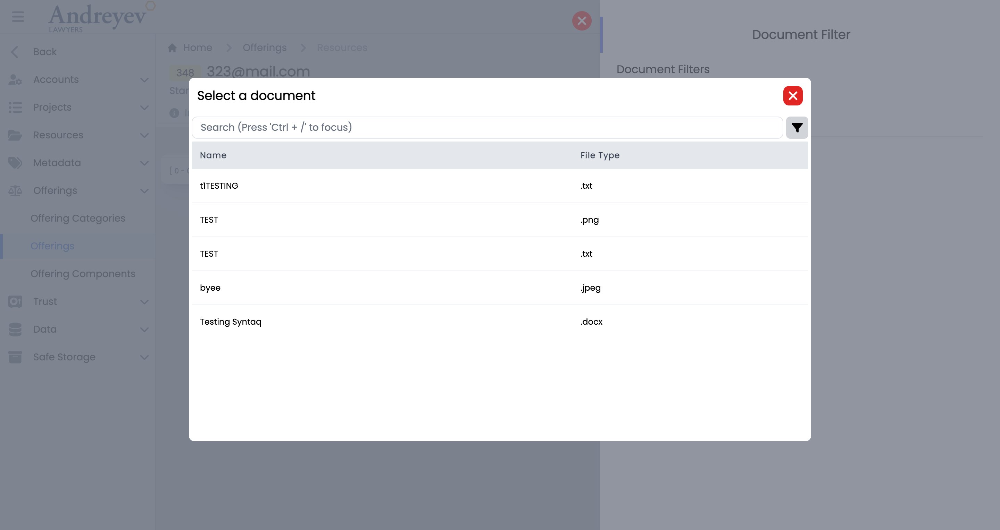

# UI User Components

This Is A brief overview of the UI ***User*** Components being used in the system today.
:::tip Note
Updated Q1 2023
:::

## GlobalModals

This file includes all commonly used modals in the ALP system to allow easier access to the modals.

This component dynamically renders a different child component based on the value of `currentModalComponent`.

`currentModalComponent` is a computed property that uses the **Vuex store's** `ModalType` enum to determine which child component to render. The enum defines a list of different modal types, each corresponding to a specific child component.

When a modal is triggered, a mutation is dispatched to the **Vuex store** to set the active modal type. The `currentModalComponent` computed property then updates based on the new state in the store, causing the appropriate child component to be rendered inside the modal window.

This can be used as follows:

```html
<template>
  <div>
    <a @click="showModal(ModalType.CreateContact, {})">
      <font-awesome-icon icon="fa-solid fa-id-card fa-2xl">
      </font-awesome-icon>
      Create Contact
    </a>

    <global-modals />
  </div>
</template>

<script>
import { useStore } from "vuex";
import GlobalModal from "@/components/GlobalModal.vue";

export default {
  components: {
    GlobalModal,
  },
  setup() {
    const store = useStore();

    function showModal(type: ModalType, props: Record<string, unknown>) {
      store.dispatch(ModalStore.actions.SHOW_MODAL, {
        modal: type,
        props
      });
    }
  }
}
```

## Clients
### CreateClient

This is a [`modal`](components-common.md#modal) using [`modalform`](components-common.md#modalform) to customise for creating a new Client.

This can be used according to [`GlobalModals`](#globalmodals).

The following is a visual of this component at work.

 
## Contacts
### CreateContact
This is a [`modal`](components-common.md#modal) using [`modalform`](components-common.md#modalform) to customise for creating a new Contact.

This can be used according to [`GlobalModals`](#globalmodals).

The following is a visual of this component at work.

### ShowACUnsubscribe
This is a [`modal`](components-common.md#modal) using [`modalform`](components-common.md#modalform) to customise for unsubscribing newsletters for a contact providing reasons.

This can be used according to [`GlobalModals`](#globalmodals).

The following is a visual of this component at work.


## Directory
### EmailGroup
This component is for fetching and displaying Email Groups, with group name and description of the group. This component enables adding of whole group to email recipient.

This component can be used as follows:
```html
<email-group
    v-if="state.selectedOption == 'groups'"
    :search = "state.search"
/>
```
The following is a visual of this component at work.

### People
This component is for fetching and displaying People, with Name, Rate, Email and description of person. This component enables adding People to email recipient.

This component can be used as follows:
```html
<people
    v-if="state.selectedOption == 'people'"
    :search = "state.search"
/>
```
The following is a visual of this component at work.


## Documents
### DocumentList
This component customises the [`Document`](#document) window and [`DocumentActions`](#documentactions) to list a table of documents.

This component can be used as follows:

```html
<document-list
  class="flex-1 mt-2"
  :loading="loading"
  :uploading="state.uploading"
  :documents="items"
  :documents-count="count"
  :can-create="can('ContactDocument.Create')"
  :can-edit="can('ContactDocument.Edit')"
  :can-delete="can('ContactDocument.Delete')"
  @fetch="fetch"
  @upload="uploadContactDocuments"
  @create-from-resource="createFromResource"
  :contactId = id
/>
```
The following is a visual of this component at work.

### Document
This component customises the [`SlideOver`](#slideover) window for managing a document draft histories.

This component can be used as follows:

```html
<document
  v-if="state.selectedDocumentId"
  :key="state.selectedDocumentId"
  :id="state.selectedDocumentId"
  :can-edit="canEdit"
  :can-delete="canDelete"
  @updated="fetchDocuments"
  @close="
    () => {
      state.selectedDocumentId = null;
      $emit('closed')
    }
  "
/>
```
The following is a visual of this component at work.

### DocumentActions
This component is for listing each document in the document list, with actions like download, add to reminder, [`RequestDocumentReview`](#requestdocumentreview), attach to email and more.

This component can be used as follows:
```html
<document-actions
  :document="item.document"
  :can-edit="false"
  :can-delete="false"
  :can-add-reminder="false"
  :can-request-review="false"
  @updated="fetchDocument"
  @deleted="$emit('close')"
/>
```

The following is a visual of this component at work.

### DocumentFilters

This component customises the [`SlideOver`](#slideover) window for managing filters in document viewing.

This component can be used as follows:

```html
<document-filters
  v-if="state.showDocumentFilters"
  class="z-50"
  v-model:matchAny="state.matchAny"
  v-model:filterParameters="state.filterParameters"
  @close="state.showDocumentFilters = false"
/>
```
The following is a visual of this component at work.

:::danger Possible Bug 
:::
### ActiveDocuments
This component shows a floating container of the active documents, displays 'No Active Document Found' when empty.

This component can be used as follows:
```html
<active-documents v-if="tab == 'active'" />
```
The following is a visual of this component at work.

### RequestDocumentReview
This is a [`modal`](components-common.md#modal) using [`modalform`](components-common.md#modalform) to customise for requesting a Staff for a document review with an included message.

This can be used according to [`GlobalModals`](#globalmodals).

The following is a visual of this component at work.

### ReceivedDocumentReviewRequests
This component is to display a floating container to show the received requests for document reviews as a reviewer.

This component can be used as follows:

```html
<received-document-review-requests v-if="tab == 'received'" />
```

The following is a visual of this component with documents and while empty.


### RequestedDocumentReviewRequests
This component is to display a floating container to show the requested document reviews and their status.

This component can be used as follows:

```html
<requested-document-review-requests v-if="tab == 'requested'" />
```
The following is a visual of this component with documents and while empty.


### CompleteDocumentReview
This is a [`modal`](components-common.md#modal) using [`modalform`](components-common.md#modalform) to customise for completing document review providing a message.

This can be used according to [`GlobalModals`](#globalmodals).

The following is a visual of this component at work.

### ResourceSelector
This component is to display a resource selector with search bar and filtering, using [`modal`](components-common.md#modal).

This component can be used as follows:

```html
<resource-selector
  v-if="resourceState.showResourceSelector"
  @create="addDocumentResource($event)"
  @close="resourceState.showResourceSelector = false"
/>
```

The following is a visual of this component at work.

### SyntaqResourceSelector
This component is to display a Syntaq resource selector with a search bar, using [`modal`](components-common.md#modal).

This component can be used as follows:

```html
<syntaq-resource-selector
  v-if="resourceState.showSyntaqSelector"
  @create="addSyntaqFormResource($event)"
  @close="resourceState.showSyntaqSelector = false"
/>
```

The following is a visual of this component at work.


## Emails
### EmailList
This component is for displaying the list of emails, with a search and filter function. It also includes a multi-select function that allows actions to emails to be done in batches.

This component can be used as follows:

```html
<email-list
  class="w-full"
  :getter="EmailStore.getters.GET_INBOX_EMAILS"
  :query="EmailStore.getters.GET_INBOX_EMAILS"
  :multiselectTrigger="true"
  :selectedEmail="true"
  @selected="$router.push({ name: 'Inbox Email', params: $event })"
  @click="selectMethod($event)"
/>
```
The following is a visual of this component at work.

### EmailDisplay
This component is to display a email in a container, including options for assigning email to matter/project, convert to pdf, and other common email options.

This component can be used as follows:
```html
<email-display
  v-if="!email?.threadEmail.length"
  can-import
  :email="email"
  :email-type="'Matter'"
  :entity-number = id
  @download-attachment="downloadAttachment"
  @import-attachment="importAttachment"
  @preview-attachment="previewAttachment"
  @close="$emit('close')"
/>
```
The following is a visual of this component at work.


## Feedback
### CreateBugReport
This is a [`modal`](components-common.md#modal) using [`modalform`](components-common.md#modalform) to customise for creating a bug report with description, priority drop down selection and file uploads.

This can be used according to [`GlobalModals`](#globalmodals).

The following is a visual of this component at work.

### CreateSuggestion
This is a [`modal`](components-common.md#modal) using [`modalform`](components-common.md#modalform) to customise for submitting a suggestion with description, type drop down selection and file uploads.

This can be used according to [`GlobalModals`](#globalmodals).

The following is a visual of this component at work.

### UploadDocument
This component is for the 'drag and drop' file upload function of the two components above, [`CreateBugReport`](#createbugreport) and [`CreateSuggestion`](#createsuggestion).

This is used as follows:
```html
  <UploadDocument @drop.prevent="drop" />
```

## Invoices
### CreateFixedPriceItem

This is a [`modal`](components-common.md#modal) using [`modalform`](components-common.md#modalform) to customise for creating fixed price items.

This component can be used as follows:

```html
<create-fixed-price-item
  v-if="state.showCreateFixedPriceItem"
  :id="id"
  @close="state.showCreateFixedPriceItem = false"
/>
```

The following is a visual of this component at work.

### CreateInvoice
This is a [`modal`](components-common.md#modal) using [`modalform`](components-common.md#modalform) to customise for creating a new invoice.

This can be used according to [`GlobalModals`](#globalmodals).

The following is a visual of this component at work.

### EditInvoiceNote
This is a [`modal`](components-common.md#modal) using [`modalform`](components-common.md#modalform) to customise for updating existing invoice notes.

This can be used according to [`GlobalModals`](#globalmodals).

The following is a visual of this component at work.

### InlineInvoice
This component is to display an invoice in a line for a page of list of invoices. This line of invoice uses colored badges to differentiate type and status of the invoice. This component also allows downloading as pdf, sending reminders and more.

This component can be used as follows:
```html
<inline-invoice
  class="mb-3 transition duration-200 shadow-lg"
  v-for="item in items"
  :key="item.id"
  :invoice="item"
  @load-more="fetch"
/>
```
The following is a visual of this component at work.

### InvoiceDisbursementSelector
This component customises the [`SlideOver`](#slideover) window for selecting a disbersement.

This component can be used as follows:

```html
<invoice-disbursement-selector
  v-if="state.showDisbursementSelector"
  :key="$route.params.id"
  :id="id"
  @close="state.showDisbursementSelector = false"
/>
```
The following is a visual of this component at work.

### InvoiceTimeEntrySelector
This component customises the [`SlideOver`](#slideover) window for managing time entries to include in the invoice.

This component can be used as follows:

```html
<invoice-time-entry-selector
  v-if="state.showTimeEntrySelector"
  :key="$route.params.id"
  :id="id"
  @close="state.showTimeEntrySelector = false"
/>
```
The following is a visual of this component at work.

### UpdateInvoiceDate
This is a [`modal`](components-common.md#modal) using [`modalform`](components-common.md#modalform) to customise for updating invoice date.

This component can be used as follows:

```html
<update-invoice-date
  v-if="state.showUpdateInvoiceDate"
  :id="invoice.id"
  @close="state.showUpdateInvoiceDate = false"
/>
```

The following is a visual of this component at work.


## Layout
### ActionMultiselect
:::danger Deprecate
:::
### AdminMenu

This component is to display the admin side menu, with toggle to hide sub sections, and most importantly, navigation links to the sections pages using [`NavLink`](components-common.md#navlink).

This component can be used as follows:

```html
<admin-menu
  v-else-if="state.showMenu === 'admin'"
  class="w-full"
  @navigated="state.expanded = false"
/>
```

The following is a visual of this component at work.

### SlideOver

This component can be used as follows:

```html
<slide-over
  heading="Matter Filters"
  v-if="viewState.showMatterFilters"
  @close="viewState.showMatterFilters = false"
>
</slide-over>
```
The following is a visual of this component at work.

### ComponentSlideOver
This component is similar to that of [`SlideOver`](#slideover), with slight changes to color and side of the slide over window.

Refer to [`SlideOver`](#slideover) for usage example.
### ProjectTaskSlideOver
This component is similar to that of [`SlideOver`](#slideover), with slight changes to color and side of the slide over window.

Refer to [`SlideOver`](#slideover) for usage example.

The following is a visual of this component at work.

### Detail
This component renders a container to contain details in a box with grey background.

This component can be used by just wrapping the contents just like that of a `div` component.

The following is a visual of this component at work.

### MasterDetail

This component can be used as follows:

```html

```

The following is a visual of this component at work.

### DocumentMenu
This component is to render the menu for documents that includes [`ActiveDocuments`](#activedocuments),[`ReceivedDocumentReviewRequests`](#receiveddocumentreviewrequests) and [`RequestedDocumentReviewRequests`](#requesteddocumentreviewrequests).

This component can be used as follows:

```html
<document-menu v-else-if="state.showMenu == 'documents'" />
```
The following is a visual of this component at work.

### DownloadMenu
This is to render the downloading menu to list current downloading jobs. 

This component can be used as follows:

```html
<download-menu v-else-if="state.showMenu == 'downloads'" />
```

The following is a visual of this component at work.

### EmailMenu
This is to render the new email floating page when clicking the top menu email option.

This component can be used as follows:

```html
<email-menu v-else-if="state.showMenu === 'emails'" />
```
The following is a visual of this component at work.

### MainMenu

This component can be used as follows:

```html
<main-menu
    :hideMenu="msg"
    v-if="state.showMenu === 'main'"
    @navigated="navigated"
/>
```

The following is a visual of this component at work.

### NotificationMenu

This component can be used as follows:

```html

```

The following is a visual of this component at work.

### ReminderMenu

This component can be used as follows:

```html

```

The following is a visual of this component at work.

### StaffDirectory
This component customises the [`SlideOver`](#slideover) window for managing permissions in the system of a role.

This component can be used as follows:

```html
<staff-directory
  :isOpen="open"
  :isLockIcon="true"
  :currentLockState="state.isStaffDirectory"
  :lockIconClick="handleStaffDirectoryLockIconClick"               
/>
```
The following is a visual of this component at work.


### TimerMenu

This component can be used as follows:

```html

```

The following is a visual of this component at work.

### Layout
This component renders the overall page for the main layout, with the top and side navigations. This consists of the [`MainMenu`](#mainmenu) for the side navigation; [`DocumentMenu`](#documentmenu),[`DownloadMenu`](#downloadmenu),[`EmailMenu`](#emailmenu),[`NotificationMenu`](#notificationmenu), [`ReminderMenu`](#remindermenu),    , and [`TimerMenu`](#timermenu)[`StaffDirectory`](#staffdirectory) used for the top nevigations.  

This component can be used as follows:
```ts
  redirect: { name: "Dashboard" },
  component: () => import("@/components/ui/layout/Layout.vue"),
```
The following is a visual of this component at work.

### FeedbackButton
:::danger Deprecate
:::
### NavBar
:::danger Deprecate
Switched to sidebar
:::


### QuickLinks
:::danger Deprecate
:::

### SideBar

This component can be used as follows:

```html
<side-bar
  :handleHover="handleExpand"
  :handleMouseLeave="handleClose"
  class="md:flex flex-shrink-0 flex-grow-0"
  :msg="state.msg"
  :showAdminMenu="state.isShowAdminMenu"
  :handleMobileviewNatigation="handleMobileviewNatigation"
/>
```
The following is a visual of this component at work.


## Mailregister
### CreateIncomingMail
This is a [`modal`](components-common.md#modal) using [`modalform`](components-common.md#modalform) to customise for registering new incoming mail.

This can be used according to [`GlobalModals`](#globalmodals).

The following is a visual of this component at work.

### CreateOutgoingMail
This is a [`modal`](components-common.md#modal) using [`modalform`](components-common.md#modalform) to customise for registering outgoing mail.

This can be used according to [`GlobalModals`](#globalmodals).

The following is a visual of this component at work.


## Matters
### AddMatterNote
This is a [`modal`](components-common.md#modal) using [`modalform`](components-common.md#modalform) to customise for adding a new matter note.

This can be used according to [`GlobalModals`](#globalmodals).

The following is a visual of this component at work.

### AddMatterOutcome

This component can be used as follows:

```html

```

The following is a visual of this component at work.

### AssignEmailToMatter
This is a [`modal`](components-common.md#modal) using [`modalform`](components-common.md#modalform) to customise for assigning email to chosen matter.

This can be used according to [`GlobalModals`](#globalmodals).

The following is a visual of this component at work.

### CreateDisbursement

This component can be used as follows:

```html
<create-disbursement
        :matter-id="id"
        v-if="state.showCreate"
        @close="state.showCreate = false"
      />
```
The following is a visual of this component at work.

### CreateMatter
This is a [`modal`](components-common.md#modal) using [`modalform`](components-common.md#modalform) to customise for creating a new matter.

This can be used according to [`GlobalModals`](#globalmodals).

The following is a visual of this component at work.

### CreateTrustTransactionRequest

This component can be used as follows:

```html

```

The following is a visual of this component at work.

### EditContactNote
This is a [`modal`](components-common.md#modal) using [`modalform`](components-common.md#modalform) to customise for editing an existing contact note.

This can be used according to [`GlobalModals`](#globalmodals).

The following is a visual of this component at work.

### EditMatterNote
This is a [`modal`](components-common.md#modal) using [`modalform`](components-common.md#modalform) to customise for editing an existing matter note.

This can be used according to [`GlobalModals`](#globalmodals).

The following is a visual of this component at work.

### InlineMatter

This component can be used as follows:

```html

```

The following is a visual of this component at work.

### InlineMatterComponent


This component can be used as follows:

```html
<inline-matter-component
  v-for="component in components"
  :key="component.id"
  class="mb-1 transition duration-200"
  :matter-id="matterId"
  :outcome-id="outcome.id"
  :component="component"
  @updated="$emit('updated')"
/>
```
The following is a visual of this component at work.

### InlineMatterOutcome

This component can be used as follows:

```html

```

The following is a visual of this component at work.


### MatterComponentTimeEntries

This component can be used as follows:

```html
<matter-component-time-entries
					:matter-id="id"
					:outcome-id="outcomeId"
					:id="componentId"
				/>
```
The following is a visual of this component at work.


### MatterTimeEntriesForMatter

This component can be used as follows:

```html
<matter-time-entries-for-matter
        v-if="state.selectedType == 'matter'"
        :id="id"
        :invoiced="state.invoiced"
        :billable-type="state.billableType"
        :user="state.user"
        :search="state.search"
        @selected="getSelectedTimeEntry($event)"
      />
```
The following is a visual of this component at work.

### MatterTrustRequests

This component can be used as follows:

```html
 <matter-trust-requests 
        v-if="state.selectedType == 'requests'" 
        :id="id" 
      />
```
The following is a visual of this component at work.

### MatterTrustTransactions

This component can be used as follows:

```html

```

The following is a visual of this component at work.

### ReassignEmails
:::danger Pending confirmation 
Possibly Deprecated
:::
<!-- This is a [`modal`](components-common.md#modal) using [`modalform`](components-common.md#modalform) to customise for registering new incoming mail.

This can be used according to [`GlobalModals`](#globalmodals).

The following is a visual of this component at work.

### UpdateMatterStatus
This is a [`modal`](components-common.md#modal) using [`modalform`](components-common.md#modalform) to customise for updating status of a matter.

This can be used according to [`GlobalModals`](#globalmodals).

The following is a visual of this component at work.


## Offerings
### InlineOfferingComponent

This component can be used as follows:

```html
<inline-offering-component
  v-for="component in components"
  :key="component.id"
  :offering-id="id"
  :outcome-id="outcome.id"
  :component="component"
/>
```
The following is a visual of this component at work.

### InlineOfferingOutcome

This component can be used as follows:

```html
<inline-offering-outcome
  class="flex-1"
  :class="{
    'border-green-300 bg-opacity-25 bg-green-300 hover:bg-red-100 hover:border-red-300':
    isSelected(item)
  }"
  :id="id"
  :outcome="item"
  @selected="selectOutcome"
/>
```
The following is a visual of this component at work.

### InlineOfferingOutcomeObjectionGuarantee
:::danger Deprecate
:::
### InlineOfferingProblemOutcome

This component can be used as follows:

```html

```

The following is a visual of this component at work.


## Organisations
### CreateOrganisation
This is a [`modal`](components-common.md#modal) using [`modalform`](components-common.md#modalform) to customise for creating a new organisation.

This can be used according to [`GlobalModals`](#globalmodals).

The following is a visual of this component at work.

### EditOrganizationNote
This is a [`modal`](components-common.md#modal) using [`modalform`](components-common.md#modalform) to customise for editing an existing organisation note.

This can be used according to [`GlobalModals`](#globalmodals).

The following is a visual of this component at work.


## Pqeadjustment
### CreatePQEAdjustment
:::danger Pending confirmation
Should this be in admin/user instead?
:::
This is a [`modal`](components-common.md#modal) using [`modalform`](components-common.md#modalform) to customise for creating PQE adjustment.

This can be used according to [`GlobalModals`](#globalmodals).

The following is a visual of this component at work.


## Projects
### AssignEmailToProject
This is a [`modal`](components-common.md#modal) using [`modalform`](components-common.md#modalform) to customise for assigning email to choosen project.

This can be used according to [`GlobalModals`](#globalmodals).

The following is a visual of this component at work.

### CreateProject
This is a [`modal`](components-common.md#modal) using [`modalform`](components-common.md#modalform) to customise for creating a new project.

This can be used according to [`GlobalModals`](#globalmodals).

The following is a visual of this component at work.

### CreateProjectTask
This is a [`modal`](components-common.md#modal) using [`modalform`](components-common.md#modalform) to customise for creating a new project task.

This can be used according to [`GlobalModals`](#globalmodals).

The following is a visual of this component at work.

### EditProjectNote
This is a [`modal`](components-common.md#modal) using [`modalform`](components-common.md#modalform) to customise for editing an existing project note.

This can be used according to [`GlobalModals`](#globalmodals).

The following is a visual of this component at work.

### InlineProject

This component can be used as follows:

```html
<inline-project
  class="mb-3 mx-1 transition duration-200 shadow-lg"
  :project="value"
  @task-selected="taskSelected(value.id, $event)"
/>
```
The following is a visual of this component at work.

### InlineProjectTask

This component can be used as follows:

```html

```

The following is a visual of this component at work.

### InlineProjectTaskCard

This component can be used as follows:

```html
<inline-project-task-card
  :project-id="id"
  :project-task="value"
  @updated="fetchProjectTasks"
  @card-clicked="cardClicked"
>
</inline-project-task-card>
```
The following is a visual of this component at work.

### InlineProjectTaskStep

This component can be used as follows:

```html

```

The following is a visual of this component at work.

### ProjectTask
This component customises the [`ProjectTaskSlideOver`](#projecttaskslideover) window for managing permissions in the system of a role.

This component can be used as follows:

```html

```
The following is a visual of this component at work.

### ProjectTaskMetadata

This component can be used as follows:

```html

```

The following is a visual of this component at work.

### ProjectTimeEntriesForProject

This component can be used as follows:

```html

```

The following is a visual of this component at work.


## Relationships
### CreateOrganisationRelationship

This component can be used as follows:

```html

```

The following is a visual of this component at work.

### CreateRelationship
This is a [`modal`](components-common.md#modal) using [`modalform`](components-common.md#modalform) to customise for filling in contact relationships, Family, Referrer and Professional.

This can be used according to [`GlobalModals`](#globalmodals).

The following is a visual of this component at work.


## Reminders
### CreateReminder
This is a [`modal`](components-common.md#modal) using [`modalform`](components-common.md#modalform) to customise for creating a new reminder with a Due Date and Resource selector.

This can be used according to [`GlobalModals`](#globalmodals).

The following is a visual of this component at work.


## Resource-urls
### ResourceUrlSelector

This component can be used as follows:

```html

```

The following is a visual of this component at work.


## Safestorage
### CreateContactSafeStorage

This component can be used as follows:

```html

```

The following is a visual of this component at work.

### CreateOrganisationSafeStorage

This component can be used as follows:

```html

```

The following is a visual of this component at work.


## Time-tracking
### CreateTimeEntry
This is a component calling [`CreateTimeEntryForm`](#createtimeentryform) into a [`modal`](components-common.md#modal) to customise for creating a new time entry.

This can be used according to [`GlobalModals`](#globalmodals).

The following is a visual of this component at work.


### CreateTimeEntryForm
This component consists of the form to fill for [`CreateTimeEntry`](#createtimeentry) using the [`modalform`](components-common.md#modalform) component.

### CreateTimeEntryForMatter
This is a component calling [`CreateTimeEntryFormForMatter`](#createtimeentryformformatter) into a [`modal`](components-common.md#modal) to customise for creating a new time entry for matter.

This can be used according to [`GlobalModals`](#globalmodals).

The following is a visual of this component at work.

### CreateTimeEntryFormForMatter
This component consists of the form to fill for [`CreateTimeEntryForMatter`](#createtimeentryformatter) using the [`modalform`](components-common.md#modalform) component.

### CreateTimeEntryForProject
This is a component calling [`CreateTimeEntryFormForProject`](#createtimeentryformforproject) into a [`modal`](components-common.md#modal) to customise for creating a new time entry inside a project.

This can be used according to [`GlobalModals`](#globalmodals).

The following is a visual of this component at work.

### CreateTimeEntryFormForProject
This component consists of the form to fill for [`CreateTimeEntryForProject`](#createtimeentryforproject) using the [`modalform`](components-common.md#modalform) component.

### InlineAddMatterTimeEntries

This component can be used as follows:

```html
<inline-add-matter-time-entries
  :start-date="startDate"
  :end-date="endDate"
/> 
```

The following is a visual of this component at work.


timetracking->timeentries->inline adding new time entry function

### InlineAddProjectTimeEntries

This component can be used as follows:

```html

```

The following is a visual of this component at work.

### InlineAddSalesTimeEntries

This component can be used as follows:

```html

```

The following is a visual of this component at work.


### InlineMatterTimeEntries

This component can be used as follows:

```html

```

The following is a visual of this component at work.

timetracking->timeentries->display time entry function

### InlineProjectTimeEntries

This component can be used as follows:

```html

```

The following is a visual of this component at work.

### InlineSalesTimeEntries

This component can be used as follows:

```html

```

The following is a visual of this component at work.


### MatterTimeEntries

This component can be used as follows:

```html

```

The following is a visual of this component at work.

`InlineAddMatterTimeEntries` + `InlineMatterTimeEntries`
### ProjectTimeEntries

This component can be used as follows:

```html

```

The following is a visual of this component at work.

### SalesTimeEntries

This component can be used as follows:

```html

```

The following is a visual of this component at work.


### SubmitTimer
This is a [`modal`](components-common.md#modal) using [`modalform`](components-common.md#modalform) to customise for submitting a new time log.

This can be used according to [`GlobalModals`](#globalmodals).

The following is a visual of this component at work.

### TimerMatterSelector
:::danger Deprecate
Using `matter-selector-field` `matter-component-selector-field` directly in `submittimer`
:::
### TimerProjectTaskSelector
:::danger Deprecate
Using `project-task-selector-field` directly in `submittimer`
:::