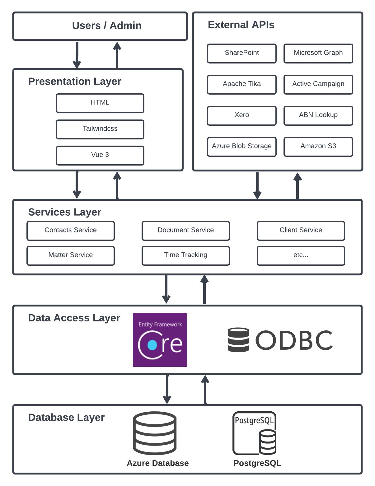

# Introduction

The ***AL Portal*** (***ALP***) is a web application developed by [SYNTAQ](https://www.syntaq.com/) to aid Law firms in all matters including client and case management, document digitalisation and automation and more. 
::: warning Used by?
&nbsp;
:::

## Why ALP?

The ***AL Portal*** for Lawyers is a futuristic solution that brings together a range of tools and features to streamline the legal workflow. 

With its comprehensive system, this portal app provides lawyers with a single platform to manage their day-to-day operations and take their legal practice to the next level. 

The app's centralized functions are designed to help lawyers work more efficiently and effectively. 
With its user-friendly interface and advanced features, the portal app helps lawyers stay organized, on top of their schedules.

Whether you are working independently or as part of a team, the portal app is an essential tool that will revolutionize the way you work and help you stay ahead of the curve in an ever-changing legal landscape.

::: danger To Be Reviewed
:::

## Application Features
***ALP*** provides services such as **Email**, **calendar**, **client** and **case** **management**, **document digitalization**, and **automation**

::: danger TODO
purpose and overview of ALP  (specifically for law firms).
:::
   

## Overall Architecture
The core ***ALP*** application is made up of the following components:

- Using ***RESTful API***. Built with ***ASP .NET Core***.
- Using ***Single Page Application (SPA)***. Built with ***Vue.js***.
- Using ***PostgreSQL*** for the database.

We also use the following supporting services.

- An ***Apache Tika Server*** for text extraction

The diagram below shows the overall architecture of the ***ALP*** application.

## Getting Started

If you aren't familiar with how to set up your development environment for these, you can continue along with this Quick Start guide for a quick how-to.