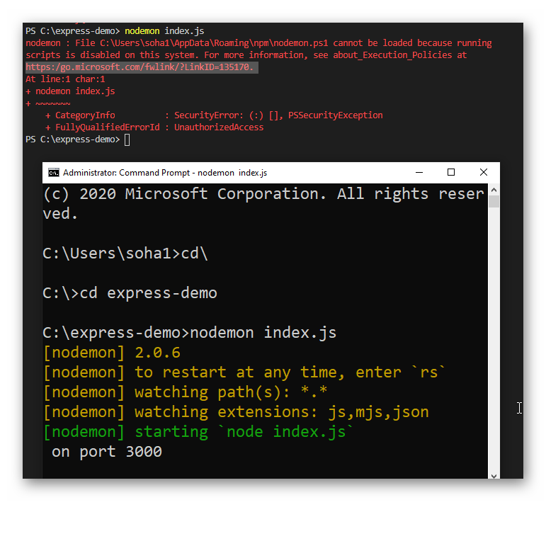

# Environment Setup

The following is needed for ALP:

- [Installing Visual Studio and .NET SDKs](#installing-visual-studio-and-net-sdks)
- [Installing Node.js and Yarn*](#installing-node-js-and-yarn)
- [Installing PostgreSQL](#installing-postgresql)


## Installing Visual Studio and .NET SDKs

The simplest way to install the .NET SDKs and tooling is to install them alongside Visual Studio.

Visual Studio may be installed from https://visualstudio.microsoft.com/. You should install the latest Community version.

While installing Visual Studio, you will be prompted to select the types of projects and, therefore the libraries you will need. At a minimum, you will need to select the ASP NET Core Web Development (or something along those lines) option. You may install other options as you see fit, but they are not required to work on the ALP application.

We are currently using .NET Core 6 for the backend development.

## Installing Node.js and Yarn*

***Vue.js*** uses Webpack as its module bundler, which requires ***Node.js***.

***Node.js*** can be installed from https://nodejs.org/. The latest LTS version is the generally recommended.

:::danger Pending
node js 16.9 or latest LTS?
:::

### Installing the Yarn Package Manager
We recommend using the ***Yarn*** package manager for managing the dependencies in the Vue.js project.

***Yarn*** can be installed with this command after node.js has been installed:

```
npm install -g yarn
```

***Yarn*** can also be installed from https://classic.yarnpkg.com/. 

While ***Yarn 2*** is available, we are currently using ***Yarn 1*** due to compatibility issues. 

This may change as support in the ecosystem improves.

### Troubleshooting for Windows user

If you are facing issues running yarn with Windows Power Shell resulting in this error:

Run Powershell as an administrator and run the following command:
```
Set-ExecutionPolicy -ExecutionPolicy RemoteSigned -Scope CurrentUser
```

## Installing PostgreSQL

To run the application locally, you need to install PostgreSQL. You can download an installer from https://www.postgresql.org/download/.

A minimum version of Postgres 12 is required due to the reliance on generated columns. Prior versions will require adjusting the definition of models that use this and the migrations that establish the generated columns. This is used to support [Full Text Search](https://www.npgsql.org/efcore/mapping/full-text-search.html?tabs=pg12%2Cv5) for more details.

:::tip
The default configuration assumes that your database has been set up with the default settings and that your local Postgres server accepts the credentials: 

`username: postgres | password: postgres`
:::