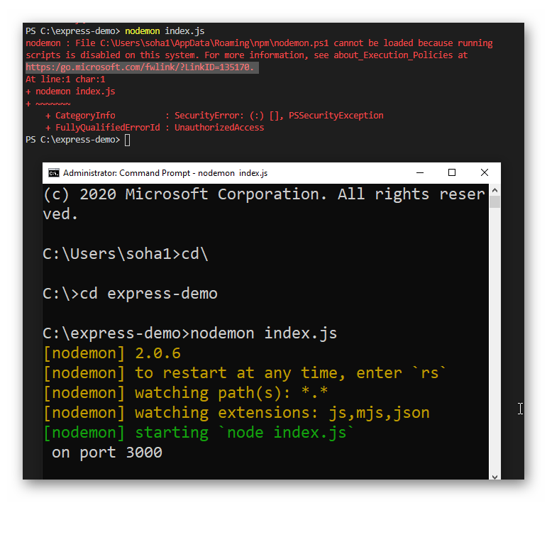

# Environment Setup - Vue.js

## Installing Node.js

Vue.js uses Webpack as its module bundler, which requires Node.js.

Node.js can be installed from https://nodejs.org/. The latest LTS version is the generally recommended version.

Yarn can be installed by this command after node has been installed:

```
npm install -g yarn
```

## For Windows user

If you are facing issue with yarn running with Windows Power Shell in such error:


Run Powershell as an administrator and run the following command:

```
Set-ExecutionPolicy -ExecutionPolicy RemoteSigned -Scope CurrentUser
```

## Installing the Yarn Package Manager

We recommend using the Yarn package manager for managing the dependencies in the Vue.js project.

This can be installed from https://classic.yarnpkg.com/. Yarn 2 is available, however due to compability issues we currently use version 1. This may change as support in the ecosystem improves.
